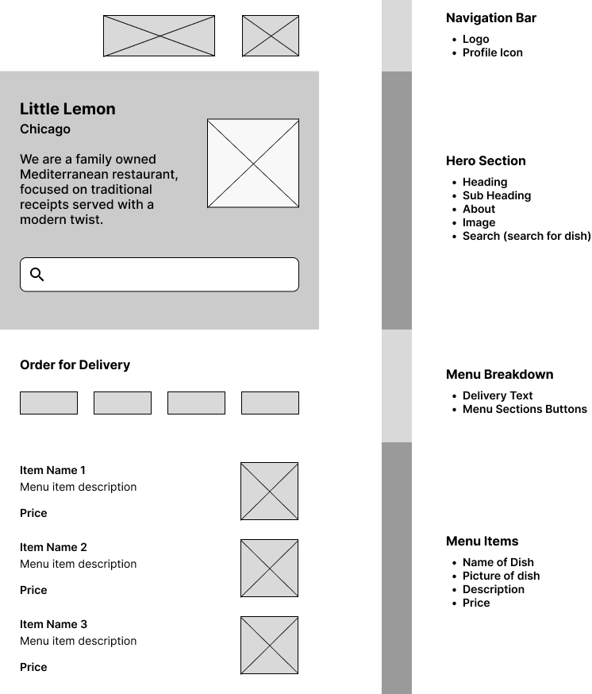
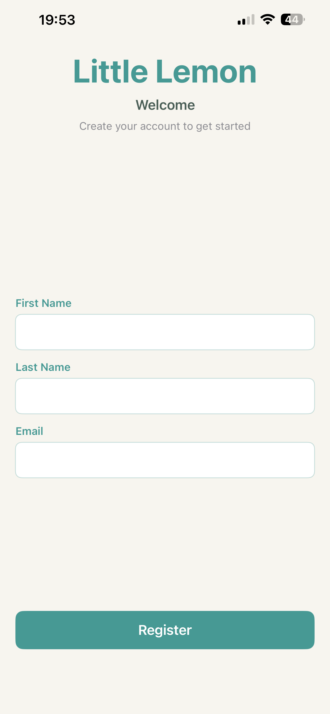
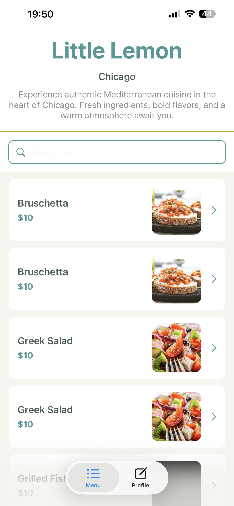
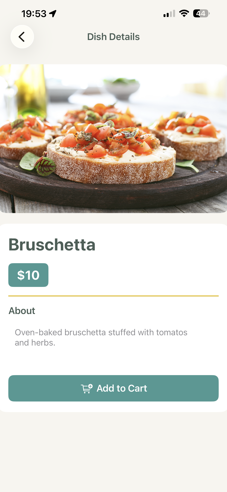
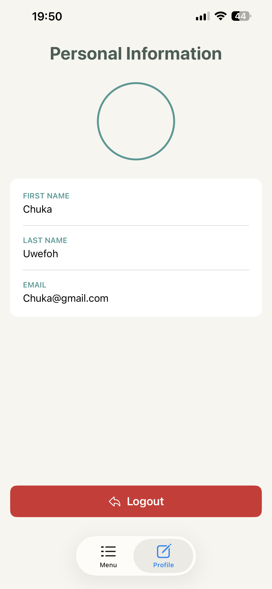

# Little Lemon Restaurant iOS App

A beautiful and fully-featured iOS restaurant ordering application built with SwiftUI and Core Data. Order authentic Mediterranean cuisine from Little Lemon restaurant in Chicago.

## 📸 Screenshots

### Wireframes


### App Screens

#### Login & Onboarding


#### Menu Screen


#### Dish Details


#### User Profile


## ✨ Features

- **User Authentication & Onboarding**
  - Email validation with regex patterns
  - User registration with persistent UserDefaults storage
  - Automatic login on app relaunch
  - User profile management with logout functionality

- **Menu Management**
  - Fetch menu items from remote API (GitHub)
  - Core Data persistence for offline access
  - Real-time search filtering (case & accent-insensitive)
  - Alphabetical sorting by dish name
  - High-quality AsyncImage display for menu items

- **Detailed Dish View**
  - Full dish information and descriptions
  - High-resolution images
  - Price display and add-to-cart functionality
  - Seamless navigation between menu and details

- **Professional UI/UX**
  - Little Lemon brand color scheme (teal, green, yellow)
  - Rounded cards and modern design
  - TabView navigation (Menu + Profile)
  - Responsive layout for all screen sizes

## 🏗️ Architecture

### Project Structure

```
LittleLemon/
├── Onboarding.swift          # Registration & login flow
├── Home.swift                # TabView with Menu & Profile tabs
├── Menu.swift                # Menu list with search & sorting
├── DishDetail.swift          # Detailed dish information view
├── UserProfile.swift         # User profile & logout
├── MenuList.swift            # JSON decoding structure
├── MenuItem.swift            # MenuItem decoding structure
├── Persistence.swift         # Core Data setup
├── FetchedObjects.swift      # Custom fetch helper
└── LittleLemon.xcdatamodeld # Core Data model
```

### Data Flow

```
Registration
    ↓
UserDefaults Storage
    ↓
Home Screen (TabView)
    ├── Menu Tab
    │   ├── Fetch from API
    │   ├── Convert to Core Data
    │   ├── Display with FetchedObjects
    │   ├── Search & Filter (NSPredicate)
    │   ├── Sort A-Z (NSSortDescriptor)
    │   └── Navigate to Details
    │
    └── Profile Tab
        └── Display User Info & Logout
```

## 🛠️ Tech Stack

### Languages & Frameworks
- **SwiftUI** - Modern declarative UI framework
- **Core Data** - Local database for menu persistence
- **URLSession** - Network requests to remote API

### Key Technologies
- **JSON Decoding** - Codable protocol for API responses
- **NSPredicate** - Dynamic filtering with case/accent-insensitive search
- **NSSortDescriptor** - Alphabetical sorting by title
- **FetchRequest** - Core Data querying and display
- **AsyncImage** - Loading images from URLs
- **UserDefaults** - User preference persistence

## 📋 Core Data Model

### Dish Entity
| Attribute | Type | Optional |
|-----------|------|----------|
| title | String | No |
| price | String | No |
| image | String | No |
| dishDescription | String | Yes |

## 🔄 API Integration

**Endpoint:** `https://raw.githubusercontent.com/Meta-Mobile-Developer-PC/Working-With-Data-API/main/menu.json`

**Response Format:**
```json
{
  "menu": [
    {
      "title": "Greek Salad",
      "price": "10.00",
      "image": "url-to-image",
      "description": "Delicious fresh salad..."
    }
  ]
}
```

**Data Flow:**
1. Fetch JSON from API on app launch
2. Decode into MenuItem structs
3. Convert to Dish Core Data entities
4. Display via FetchedObjects with search & sort
5. Clear database before each refresh

## 🎨 UI/UX Design

### Little Lemon Brand Colors
- **Primary Green (Teal):** `#47A898` - Headers, buttons, accents
- **Dark Green:** `#4A5E57` - Titles, important text
- **Bright Yellow:** `#F4CE14` - Divider lines, accents
- **Light Background:** `#F8F6F1` - App background

### Design Features
- Rounded corners (8-16pt radius)
- White cards with subtle shadows
- Green search icon in search bar
- Chevron navigation indicators
- Professional typography with weight hierarchy
- Responsive spacing and padding

## 🔍 Search & Filter

### Search Implementation
```swift
private func buildPredicate() -> NSPredicate {
    if searchText.isEmpty {
        return NSPredicate(value: true)  // Show all
    } else {
        // Case & accent-insensitive search
        return NSPredicate(format: "title CONTAINS[cd] %@", searchText)
    }
}
```

### Sorting Implementation
```swift
private func buildSortDescriptors() -> [NSSortDescriptor] {
    return [
        NSSortDescriptor(key: "title", ascending: true, 
                        selector: #selector(NSString.localizedStandardCompare))
    ]
}
```

## 🚀 Getting Started

### Prerequisites
- Xcode 14+
- iOS 15+
- Swift 5.7+

### Installation

1. **Clone the repository**
```bash
git clone https://github.com/chukaufo/littlelemon.git
cd littlelemon
```

2. **Open in Xcode**
```bash
open LittleLemon.xcodeproj
```

3. **Create Core Data Model**
   - File > New > File
   - Select "Data Model" (Core Data)
   - Name it "LittleLemon"
   - Add Entity "Dish" with attributes:
     - `title` (String, Required)
     - `price` (String, Required)
     - `image` (String, Required)
     - `dishDescription` (String, Optional)

4. **Build and Run**
   - Select target device/simulator
   - Press Cmd+R to run

## 📱 Usage

1. **Register**
   - Enter first name, last name, email
   - Tap "Register" to create account
   - Email validation ensures proper format

2. **Browse Menu**
   - View all dishes sorted alphabetically
   - Use search bar to filter by dish name
   - Search is case & accent-insensitive

3. **View Details**
   - Tap any dish to see full information
   - View high-quality image
   - Read complete description
   - See price

4. **Manage Profile**
   - Switch to Profile tab
   - View your registered information
   - Tap "Logout" to return to login screen

## 🔐 Authentication

- Email validation with regex pattern matching
- User data stored in UserDefaults
- Login state persists across app sessions
- Automatic logout clears login flag

## 📊 Database

- **Type:** Core Data (SQLite)
- **Scope:** Personal (in-memory for testing)
- **Persistence:** LittleLemon.xcdatamodeld
- **Auto-refresh:** Clears and reloads on app launch

## 🧪 Testing

### Test Scenarios
- ✅ Register with valid email
- ✅ Login and auto-relaunch
- ✅ Search menu items
- ✅ Sort alphabetically
- ✅ View dish details
- ✅ Logout and return to login

### Sample Test Data
- Greek Salad - $10.00
- Bruschetta - $7.99
- Grilled Fish - $20.00
- Lemon Dessert - $9.99

## 📈 Future Enhancements

- [ ] Shopping cart functionality
- [ ] Order history
- [ ] Payment integration
- [ ] Restaurant location & hours
- [ ] User reviews and ratings
- [ ] Dietary preferences/allergies
- [ ] Push notifications for promotions
- [ ] Dark mode support
- [ ] Localization (multiple languages)
- [ ] Unit & UI tests

## 🤝 Contributing

Contributions are welcome! Please feel free to submit pull requests or open issues for bugs and features.

## 📄 License

This project is part of the Meta iOS Developer Course.

## 👨‍💻 Author

**Chuka Uwefoh** (@chukaufo)
- GitHub: [chukaufo](https://github.com/chukaufo)
- Portfolio: [chukaufo.com](https://chukaufo.com)

## 🙏 Acknowledgments

- Meta iOS Developer Professional Certificate
- Coursera
- Little Lemon Restaurant concept
- SwiftUI & Core Data documentation

---

**Last Updated:** July 27, 2026  
**Version:** 1.0.0  
**Status:** Complete & Functional ✅
